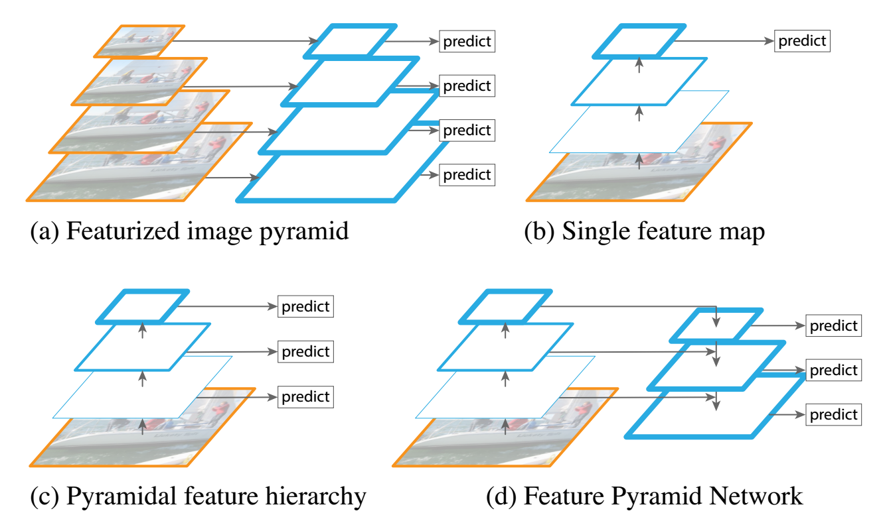

# Deep Convolutional Neural Networks
State of the art for many vision applications!

\begin{figure}
\includegraphics[width=1.0\textwidth]{images/fcn2.png}
\end{figure}

# Deep Convolutional Neural Networks

State of the art for many vision applications!

Object Detection:

\begin{figure}
\includegraphics[width=0.4\textwidth]{images/chair_02.jpg}~
\includegraphics[width=0.4\textwidth]{images/person_06.jpg}
\caption{Detect the object}
\end{figure}

# Deep Convolutional Neural Networks

State of the art for many vision applications!

Object Detection:

\begin{figure}
\includegraphics[width=0.4\textwidth]{images/car.png}~
\includegraphics[width=0.4\textwidth]{images/people.jpg}
\caption{Detect the object}
\end{figure}

# Deep Convolutional Neural Networks

State of the art for many vision applications!

Object Detection:

\begin{figure}
\includegraphics[width=0.4\textwidth]{images/detect.png}~
\includegraphics[width=0.4\textwidth]{images/lost.jpg}
\caption{Detect the object}
\end{figure}

# Deep Convolutional Neural Networks

State of the art for many vision applications!

Object Counting:

\begin{figure}
\includegraphics[width=0.4\textwidth]{images/crowdcount.jpg}~
\includegraphics[width=0.4\textwidth]{images/penguin.JPG}
\caption{Number of objects in the image}
\end{figure}

# Deep Convolutional Neural Networks

State of the art for many vision applications!

Object Segmentation:

\begin{figure}
\includegraphics[width=0.8\textwidth]{images/cityscape.jpg}
\caption{Predict the class of each pixel label}
\end{figure} 

# Problem Statement

Image segmentation using deep convolutional neural networks (CNN)

\begin{figure}
\includegraphics[width=0.2\textwidth]{images/t1.png}~
\includegraphics[width=0.5\textwidth]{images/dnn.png}~
\includegraphics[width=0.2\textwidth]{images/t2.png}
\caption{Using DNN to segment image}
\end{figure}

# Problem Statement

Image segmentation using deep convolutional neural networks (CNN)

\begin{figure}
\includegraphics[width=0.2\textwidth]{images/t1.png}~
\includegraphics[width=0.2\textwidth]{images/t2.png}~
\includegraphics[width=0.2\textwidth]{images/t4.png}
\caption{From left to right: (1) Original Image; (2) CNN Prediction; (3) Groundtruth}
\end{figure}

* Segmentation map: $\hat{Y} = \max_j \frac{\exp({f_j(X|\theta)})}{\sum_k \exp(f_k(X|\theta))}$

# Problem Statement

Image segmentation using deep convolutional neural networks (CNN)

\begin{figure}
\includegraphics[width=0.2\textwidth]{images/t1.png}~
\includegraphics[width=0.2\textwidth]{images/t2.png}~
\includegraphics[width=0.2\textwidth]{images/t4.png}
\caption{From left to right: (1) Original Image; (2) CNN Prediction; (3) Groundtruth}
\end{figure}

\begin{small}
Segmentation map: $\hat{Y} = \max_j \frac{\exp({f_j(X|\theta)})}{\sum_k \exp(f_k(X|\theta))}$

Prediction output can be made more accurate 

\end{small}

* Take into account change of color pixel intensity (smoothness)

# Problem Statement

Use conditional random fields:

* Smoothens noisy segmentation maps
* Energy function to minimize:
        $$E(y) =  \sum_i \underbrace{\phi_u(y_i)}_{\text{unary potential}} + \sum_{ij} \underbrace{\phi_p(y_i, y_j)}_{\text{pairwise potential}}$$

# Problem Statement

Use conditional random fields:

* Smoothens noisy segmentation maps
* Energy function to minimize:
        $$E(y) =  \sum_i \underbrace{\phi_u(y_i)}_{\text{unary potential}} + \sum_{ij} \underbrace{\phi_p(y_i, y_j)}_{\text{pairwise potential}}$$

Unary Potentials:
\begin{small}
\begin{equation}
\begin{split}
\phi_u(y_i) &= - \log{P(y_i| X_i, \theta)} = - \log{\frac{\exp({f_{y_i}(X_i|\theta)})}{\sum_k \exp(f_k(X_i|\theta))}}
\end{split}
\end{equation}
\end{small}

Pairwise Potentials:
\begin{small}
\begin{equation}
\begin{split}
\phi_p(y_i, y_j) &= (y_i \neq y_j)[w_1 \exp(-\frac{||L_i - L_j||}{\sigma_L} - \frac{||I_i - I_j||}{\sigma_I}) + \\ & w_2\exp(-\frac{||L_i - L_j||}{\sigma_L})]
\end{split}
\end{equation}
\end{small}

# Problem Statement

Use conditional random fields:

* Smoothens noisy segmentation maps
* Energy function to minimize:
        $$E(y) =  \sum_i \underbrace{\phi_u(y_i)}_{\text{unary potential}} + \sum_{ij} \underbrace{\phi_p(y_i, y_j)}_{\text{pairwise potential}}$$
* Encourages neighboring nodes to have the same label

\begin{figure}
\includegraphics[width=0.5\textwidth]{images/X.png}
\caption{(Left) Original noisy image; (Right) Smooth output from minimizing E(Y)}
\end{figure}

# Problem Statement

\begin{figure}
\includegraphics[width=0.2\textwidth]{images/t1.png}~
\includegraphics[width=0.5\textwidth]{images/dnn.png}~
\includegraphics[width=0.2\textwidth]{images/t2.png}
\end{figure}

\begin{figure}
\includegraphics[width=0.2\textwidth]{images/t2.png}~
\includegraphics[width=0.5\textwidth]{images/crf.png}~
\includegraphics[width=0.2\textwidth]{images/t4.png}
\caption{Penalty: $\phi_p(y_i, y_j) = (y_i \neq y_j)\exp(-\frac{||I_i - I_j||^2}{\sigma_I} - \frac{||L_i - L_j||^2}{\sigma_L})$}
\end{figure}

# Problem Statement

\begin{figure}
\includegraphics[width=0.2\textwidth]{images/b1.png}~
\includegraphics[width=0.5\textwidth]{images/dnn.png}~
\includegraphics[width=0.2\textwidth]{images/b2.png}
\caption{Fitting term: $\phi_p(y_i) = - \log P(\hat{Y} = y_i) = -\log P(f(X|\theta) = y_i)$}
\end{figure}

\begin{figure}
\includegraphics[width=0.2\textwidth]{images/b2.png}~
\includegraphics[width=0.5\textwidth]{images/crf.png}~
\includegraphics[width=0.2\textwidth]{images/b4.png}
\caption{Penalty: $\phi_p(y_i, y_j) = (y_i \neq y_j)\exp(-\frac{||I_i - I_j||^2}{\sigma_I} - \frac{||L_i - L_j||^2}{\sigma_L})$}
\end{figure}

# Step 1: Optimizing the DNN step

\begin{figure}
\includegraphics[width=0.2\textwidth]{images/t1.png}~
\includegraphics[width=0.5\textwidth]{images/dnn.png}~
\includegraphics[width=0.2\textwidth]{images/t2.png}
\end{figure}

Optimize DNN on the training set:
\begin{small}
\begin{equation}
\min_\theta ||f(X_i|\theta) - y_i||^2 \;\;\;\;\; \text{($X_i$ is an image, $Y_i$ is the image label)}
\end{equation}
\end{small}
Equivalent to minimizing the unary potentials:
\begin{small}
\begin{equation}
\hat{E}(\theta) = \sum_i ||f(X_i|\theta) - y_i||^2 =  \sum_i \phi_u(y_i|\theta) \;\;\;\;\; \text{(y here is the true label)}
\end{equation}
\end{small}

# Step 2: Optimizing the CRF step

\begin{figure}
\includegraphics[width=0.2\textwidth]{images/t2.png}~
\includegraphics[width=0.5\textwidth]{images/crf.png}~
\includegraphics[width=0.2\textwidth]{images/t4.png}
\end{figure}

Step 1 optimize DNN on train images:
\begin{small}
\begin{equation}
\hat{E}(\theta) = \sum_i ||f(X_i|\theta) - y_i||^2 =  \sum_i \phi_u(y_i|\theta) \;\;\;\;\; \text{(y here is the true label)}
\end{equation}

Step 2 optimize CRF on test images,
\begin{equation}
E(y) =  \sum_i \phi_u(y_i) + \sum_{ij} \phi_p(y_i, y_j) \;\;\;\;\; \text{(y here is a parameter)}
\end{equation}
\end{small}

# Convolutional Neural Network for Classification
\begin{figure}
\includegraphics[width=1.0\textwidth]{images/conv.png}
\end{figure}

Objective function:

* Maximize
\begin{equation}
P(y_i=j| X_i, \theta) = \frac{\exp({f(X_i|\theta)})}{\sum_k \exp(f(X_i|\theta))} \;\;\;\; \forall i
\end{equation}

* Alternatively optimize (uncostrained optimization)
\begin{equation}
\min_{\theta} - \sum_i \log P(y_i=j | X_i, \theta) \;\;\;\; \forall i
\end{equation}

# Fully Convolutional Network For Segmentation
\begin{figure}
\includegraphics[width=0.5\textwidth]{images/fcn2.png}
\end{figure}

Objective function:

* Maximize
\begin{equation}
P(Y_{ip}=j| X_i, \theta) = \frac{\exp({f_p(X_i|\theta)})}{\sum_k \exp(f_p(X_i|\theta))} \;\;\;\; \forall i, p
\end{equation}

* Alternatively optimize (uncostrained optimization)
\begin{equation}
\min_{\theta} - \sum_i \sum_p \log P(Y_{ip}=j| X_i, \theta) \;\;\;\; \forall i, p
\end{equation}

# Fully Convolutional Network For Segmentation
\begin{figure}
\includegraphics[width=0.9\textwidth]{images/fcn.png}
\end{figure}

Objective function:

* Maximize
\begin{equation}
P(Y_{ip}=j| X_i) = \frac{\exp({f_p(X_i|\theta)})}{\sum_k \exp(f_p(X_i|\theta))} \;\;\;\; \forall i, p
\end{equation}

* Alternatively optimize (uncostrained optimization)
\begin{equation}
\min_{\theta} - \sum_i \sum_p \log P(Y_{ip}=j| X_i) \;\;\;\; \forall i, p
\end{equation}

# Fully Convolutional Network For Segmentation
\begin{figure}
\includegraphics[width=0.9\textwidth]{images/fcn.png}
\end{figure}

Interpolation:
\begin{figure}
\includegraphics[width=0.45\textwidth]{images/bil.png}
\end{figure}

# U-Net
\begin{figure}
\includegraphics[width=1.0\textwidth]{images/unet.png}
\end{figure}

# U-Net
\begin{figure}
\includegraphics[width=1.0\textwidth]{images/unet2.png}
\end{figure}

# U-Net
\begin{figure}
\includegraphics[width=0.5\textwidth]{images/unet2.png}
\caption{State of the art on the ISBI cell tracking challenge 2015.}
\end{figure}

\begin{figure}
\includegraphics[width=0.6\textwidth]{images/results.png}
\caption{Segmentation results (IOU) on the ISBI cell tracking challenge 2015.}
\end{figure}
 

# U-Net
\begin{figure}
\includegraphics[width=0.5\textwidth]{images/iou.png}
\end{figure}

\begin{figure}
\includegraphics[width=0.6\textwidth]{images/results.png}
\caption{\small Segmentation results (IOU) on the ISBI cell tracking challenge 2015.}
\end{figure}
 

# FCN + Conditional Random Fields
\begin{figure}
\includegraphics[width=0.6\textwidth]{images/crf_map.png}
\end{figure}
 

Objective function:
\begin{equation}
\begin{split}
\min_y E(y) &= \min \sum_i \phi_u(y_i) + \sum_{ij} \phi_p(y_i, y_j)
\end{split}
\end{equation}

# FCN + Conditional Random Fields
\begin{figure}
\includegraphics[width=0.6\textwidth]{images/crf_map.png}
\end{figure}

Objective function:
\begin{equation}
\begin{split}
\min_y E(y) &= \min \sum_i \phi_u(y_i) + \sum_{ij} \phi_p(y_i, y_j)\\
\phi_u(y_i) &= - \log{P(y_i| X_i, \theta)} = - \log{\frac{\exp({f_{y_i}(X_i|\theta)})}{\sum_k \exp(f(X_i|\theta))}}
\end{split}
\end{equation}

# FCN + Conditional Random Fields

Energy Term:
\begin{small}
\begin{equation}
\begin{split}
\min_y E(y) &= \min \sum_i \phi_u(y_i) + \sum_{ij} \phi_p(y_i, y_j)\\
\end{split}
\end{equation}
\end{small}

Unary Potentials:
\begin{small}
\begin{equation}
\begin{split}
\phi_u(y_i) &= - \log{P(y_i| X_i, \theta)} = - \log{\frac{\exp({f_{y_i}(X_i|\theta)})}{\sum_k \exp(f(X_i|\theta))}}
\end{split}
\end{equation}
\end{small}

Pairwise Potentials:
\begin{small}
\begin{equation}
\begin{split}
\phi_p(y_i, y_j) &= (y_i \neq y_j)[w_1 \exp(-\frac{||L_i - L_j||}{\sigma_L} - \frac{||I_i - I_j||}{\sigma_I}) + \\ & w_2\exp(-\frac{||L_i - L_j||}{\sigma_L})]
\end{split}
\end{equation}
\end{small}

# Conditional Random Field

CRF formulation:
\begin{equation}
\min_{y \in \{0, 1\}^n} E(y) = \min_{y \in \{0, 1\}^n} \sum_i \phi_u(y_i) + \sum_{ij} \phi_p(y_i, y_j)
\end{equation}

Mean Field Approximation

* Do not compute the exact distribution $P(Y)$ of the CRF
* Compute a distribution $Q(Y)$ where,

    * Q minimizes $KL(Q||P)$; and
    * $Q(Y) = \prod_i Q_i(Y_i)\;\;\;\;\;\;\;$    (independent marginals)

# Conditional Random Field

CRF formulation:
\begin{equation}
\min_{y \in \{0, 1\}^n} E(y) = \min_{y \in \{0, 1\}^n} \sum_i \phi_u(y_i) + \sum_{ij} \phi_p(y_i, y_j)
\end{equation}

\begin{equation}
\begin{split}
\min_{y \in \{0, 1\}^n} E(y) = \min_{y \in \{0, 1\}^n} & \sum_i - \log{\frac{\exp({f(X_i|\theta)})}{\sum_k \exp(f(X_i|\theta))}} + \\
& \sum_{ij} (y_i \neq y_j) w \cdot k(y_i, y_j)
\end{split}
\end{equation}

\begin{equation}
k(y_i, y_j) =  \exp(-\frac{||L_i - L_j||}{\sigma_L} - \frac{||I_i - I_j||}{\sigma_I}) + w_2\exp(-\frac{||L_i - L_j||}{\sigma_L})
\end{equation} 

# Conditional Random Field

CRF formulation:
\begin{equation}
\min_{y \in \{0, 1\}^n} E(y) = \min_{y \in \{0, 1\}^n} \sum_i \phi_u(y_i) + \sum_{ij} \phi_p(y_i, y_j)
\end{equation}

The iterative step from minimizing the KL divergence w.r.t. $Q$:
\begin{small}
\begin{equation}
Q_i(c) = \frac{1}{Z_i} (- \phi_u(y_i) - \sum_{c'} (c \neq c') w \sum_j k(y_i, y_j) Q_j(c'))
\end{equation}
\end{small}

Consteraints 

*   $Q_i(y_i)$ is a valid distribution (positive and adds up to one)

*   $Q(y) = \prod_i Q_i(y_i)$ (independent marginals)

# Conditional Random Field
The iterative step from minimizing the KL divergence w.r.t. $Q$:
\begin{small}
\begin{equation}
Q_i(c) = \frac{1}{Z_i} (- \phi_u(y_i) - \sum_{c'} (c \neq c') w \sum_j k(y_i, y_j) Q_j(c'))
\end{equation}
\end{small}

\begin{small}
\begin{algorithm}[H]
 \KwData{Image $I$, DNN output segmentation maps $y$}
 \KwResult{$Q(Y)$, an approximation of the CRF distribution}
 Initialize $Q$\;
 \While{while not converged do}{
  $\bar{Q}_i(y_i=c) \leftarrow \sum_{j} k(y_i, y_j)Q_j(y_i=c)$ \hfill Message passing $O(n^2)$\;
  $\hat{Q_i}(y_i) \leftarrow \sum_{c\in C} (y_i \neq c) w \bar{Q}_i(y_i=c)$ \hfill Compat. transform $O(n)$\;
  $Q_i(y_i) \leftarrow  \exp\{-\phi_u(y_i) - \hat{Q_i}(y_i)\}$ \hfill Local update $O(n)$\;
  normalize $Q_i(y_i)$
 }
 \caption{Mean field in fully connected CRFs}
\end{algorithm}
\end{small}

# Example

CRF formulation:
\begin{equation}
\min_{y \in \{0, 1\}^n} E(y) = \min_{y \in \{0, 1\}^n} \sum_i \phi_u(y_i) + \sum_{ij} \phi_p(y_i, y_j)
\end{equation}

\begin{figure}
\includegraphics[width=0.5\textwidth]{images/X.png}
\caption{(Left) Original noisy image; (Right) Smooth output from minimizing E(Y)}
\end{figure}

# Example

CRF formulation:
\begin{equation}
\min_{y \in \{0, 1\}^n} E(y) = \min_{y \in \{0, 1\}^n} \sum_i - \log{P(y_i| X_i, \theta)} + \sum_{ij} (y_i \neq y_j) w \cdot k(y_i, y_j)
\end{equation}

\begin{figure}
\includegraphics[width=0.5\textwidth]{images/X.png}
\caption{(Left) Original noisy image; (Right) Smooth output from minimizing E(Y)}
\end{figure}

# PASCAL Dataset for Segmentation
\begin{figure}
\includegraphics[width=0.3\textwidth]{images/stats.png}
\end{figure}

# PASCAL Dataset for Segmentation

\begin{figure}
\includegraphics[width=0.8\textwidth]{images/s1.png}
\end{figure}

\begin{figure}
\includegraphics[width=0.8\textwidth]{images/s2.png}
\end{figure}

# PASCAL Dataset for Segmentation

\begin{figure}
\includegraphics[width=0.8\textwidth]{images/s1.png}
\end{figure}

\begin{figure}
\includegraphics[width=0.8\textwidth]{images/s2.png}
\end{figure}

# Deep Convolutional Neural Networks

\begin{figure}
\includegraphics[width=0.2\textwidth]{images/p0.png}~
\includegraphics[width=0.5\textwidth]{images/dnn.png}~
\includegraphics[width=0.2\textwidth]{images/p1.png}
\caption{DNN is based on VGG16, a popular CNN architecture [1]}
\end{figure}

\begin{tiny}
[1] Liang-Chieh, Chen, et al. "Semantic image segmentation with deep convolutional nets and fully connected crfs."
\end{tiny}

# Deep Convolutional Neural Networks with CRF

\begin{figure}
\includegraphics[width=0.2\textwidth]{images/i1.png}~
\includegraphics[width=0.5\textwidth]{images/dnn.png}~
\includegraphics[width=0.2\textwidth]{images/p1.png}
\caption{DNN is based on VGG16, a popular CNN architecture}
\end{figure}

\begin{figure}
\includegraphics[width=0.2\textwidth]{images/p1.png}~
\includegraphics[width=0.5\textwidth]{images/crf.png}~
\includegraphics[width=0.2\textwidth]{images/crf1.png}
\caption{After CRF 10 iterations}
\end{figure}

# Results

\begin{figure}
\includegraphics[width=0.2\textwidth]{images/p1.png}~
\includegraphics[width=0.5\textwidth]{images/crf.png}~
\includegraphics[width=0.2\textwidth]{images/crf1.png}
\end{figure}

\begin{figure}
\includegraphics[width=0.7\textwidth]{images/t11.png}
\caption{Results - IOU}
\end{figure}

# Conclusion

* Deep convolutional neural networks
    
    * State-of-the-art for many vision tasks

* Conditional random fields helps refine the output segmentation map

    * Use mean-field approximation to estimate the CRF distribution
    * Every iteration naively has $O(n^2)$ time complexity

* State-of-the-art results on image segmentation in PASCAL VOC 2012 dataset

<!--
Example"

# Relevant Paper

* based on VGG16

# PASCAL DATASET FOR SEGMENTATION

# OBJECTIVE FUNCTION

# Evaluation

# CONCLUSION

<!-- * Alternatively optimize (uncostrained optimization)
\begin{equation}
\min_{\theta} - \sum_i \sum_p \log P(Y_{ip}=j| X_i) \;\;\;\; \forall i, p
\end{equation}
 -->
<!-- 

# BASIC NETWORK 

* Objective function:

\begin{equation}
3x
\end{equation}

# UNET

# FEATURE PYRAMID
* Objective function:

# UNET 

# FEATURE PYRAMID
* Objective function:

# Other models

* Objective function:

# Conditional Random Field

* To smoothen a noisy segmentation

Objective Function

# CODE

# LIVE EXPERIMENT

# Convolutional Neural Networks

# Fully Convolutional Neural Networks

# Conditional Random Field

* CRF 

\begin{equation}
E(x) = \sum_i f(x_i) + \sum_{ij} g(x_i, y_j)
\end{equation} 

\begin{equation}
f(x_i) = 2x
\end{equation} 

\begin{equation}
g(x_i, x_j) = 3x
\end{equation} 

* Mean Field Approximation 

\begin{equation}
Q(x_i)
\end{equation} 

\begin{equation}
Q(x_i)
\end{equation} 

# Experiments

# Conclusion 

 -->
<!-- # Granger Causality 

* Correlation does not imply causation

* Causation does not imply linear or poisson correlation 
    * Although there must some association between the variables
\begin{figure}[h]
\centering
\includegraphics[width=0.6\textwidth]{images/corrs.png}
\end{figure}

 -->